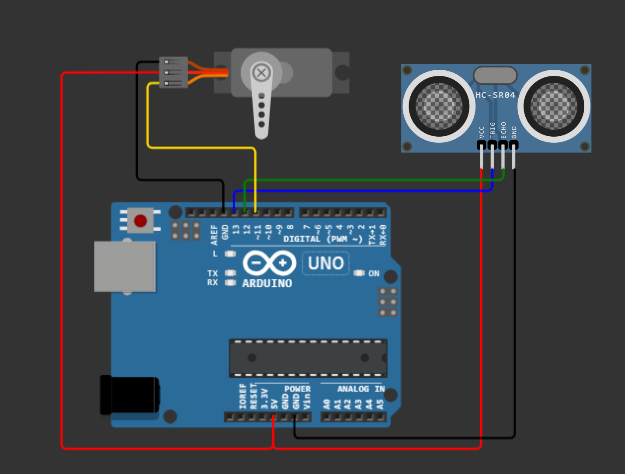

# วิธีต่อสาย

## Servo
| Servo | Arduino Port |
|-------|--------------|
| GND   | GND          |
| VCC   | 5V           |
| PWM   | 11           |

## Ultrasonic HC-SR04
| HC-SR04 | Arduino |
|---------|---------|
| VCC     | 5V      |
| TRIG    | 13      |
| ECHO    | 12      |
| GND     | GND     |

## Wiring

